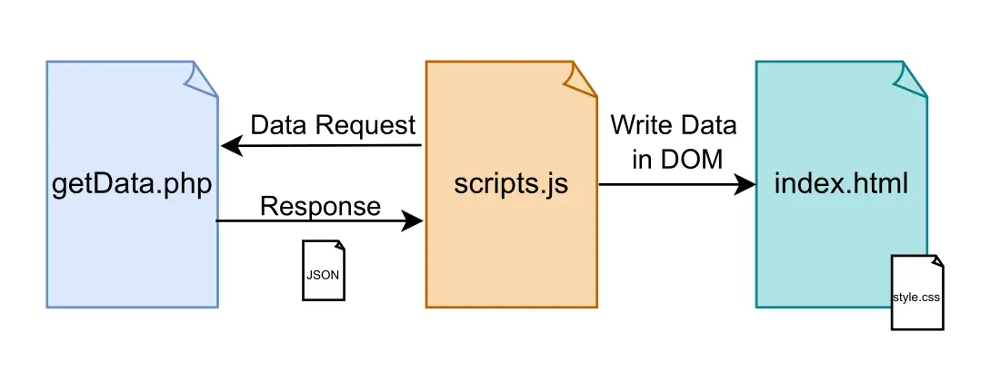
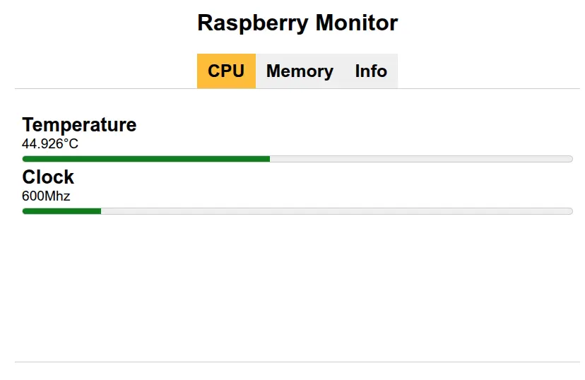
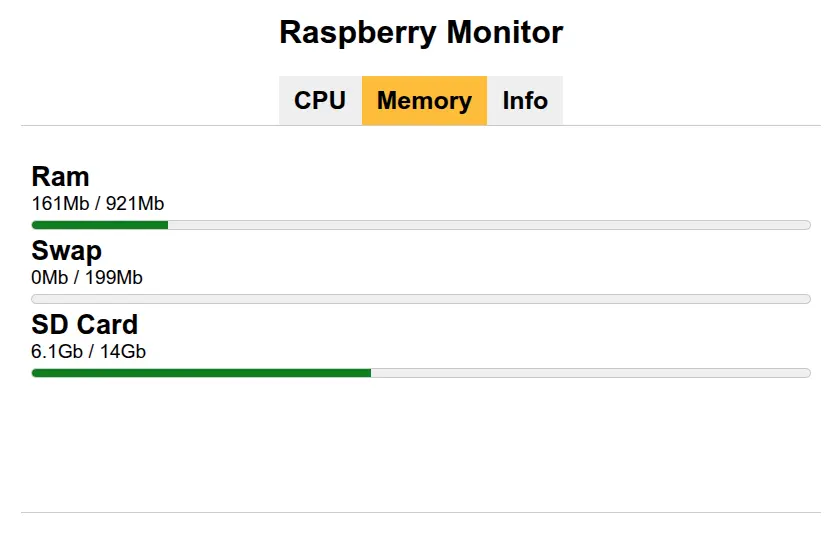
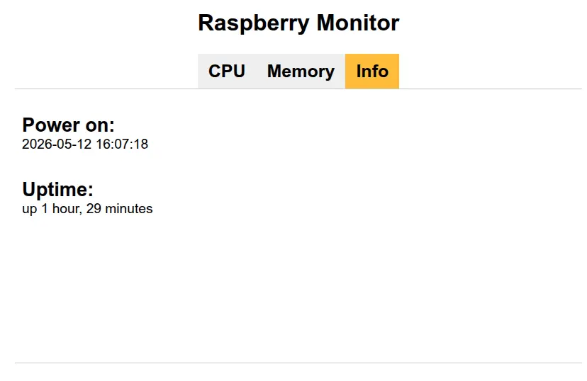

# Raspberry Pi System Monitor

A simple javacript web app that resume the system information.

## How it Works

### Requrements

- A Raspberry Pi (the app has been tested on Raspberry Pi 2 model B)
- A Web Server (the app has been tested on apache)

## Workflow

The webapp retrive data from **getData.php** page that generates a JSON. The page getData.php file must be saved on raspberry pi.

The javascrpit script gets the JSON from given URL in an async function and writes the data on html page **index.html** every 2 seconds.

The data is showed in three different cards:

1. **CPU**: shows the Temperature (in Celsius) and the Clock (in Mhz)

2. **Memory**: shows the ammount of RAM in use and free, SWAP used and free, SD Card used and free

3. **Info**: shows the date when the system has been started and the uptime

The webapp is otipmized to be accessible from mobile devices.

# Final Note
This project has been tested in a local network, is simple and dosen't implement a login system.
